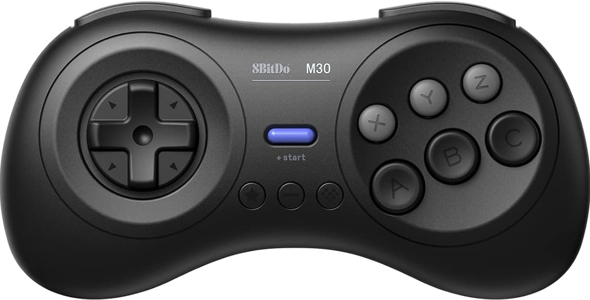

Put these folders mister-8bitDo-M30 and mister-8bitDo-Pro2 in <RetroSpy program folder>\skins\MiSTer 
You may have to remap the buttons, the values my controllers were reporting changed suddenly.

# RetroSpy Skins by dtungsten

### [Download the latest dtungsten skins](https://github.com/dtungsten/dtungsten-RetroSpy-MiSTer-skins/releases/latest)

This contains a various list of skins created by dtungsten for use with RetroSpy.

## Skins Included In Latest Version

#### 8bitDo M30 (types: MiSTer, linuxjoystick)

#### 8bitDo Pro2 (types: MiSTer, linuxjoystick)

## Installation

Simply drop the skins from the zip into the skins folder inside the RetroSpy folder you have. 

*Note that there is a separate folder for MiSTer skins that needs to be added to the skins/MiSTer folder inside of RetroSpy.*

## FAQs

### What is RetroSpy?

A fork of NintendoSpy, RetroSpy is designed to present controller inputs from a console or computer in a display window. This allows you to show your controller inputs for things like speedrunning, game tutorials, and more. You can also convert controller presses into keystrokes to control programs on your computer such as LiveSplit and OBS.

#### [For more information or to download RetroSpy, see the GitHub page.](https://github.com/retrospy/RetroSpy)

---
<!--
### My Buttons Are Wrong!

Sometimes, a controller might be mapped differently compared to what the skin has mapped.  

In order to fix this, follow these steps:

| Step | Example |
| :----------- | :----------- |
| 1. Open RetroSpy | |
| 2. Run the "helper" skin for the category/type you are using (generic, MiSTer, etc) |  |
| 3. When you press buttons, you will see what value that buttons correlates to |  ||
| 4. Open the skin folder of the skin you want to fix | |
| 5. Open the skin.xml file in a text editor | |
| 6. Change the respective button name to match the output you are seeing in the helper |  |
| 7. Save the file | |
| 8. Restart RetroSpy | |

--- -->
